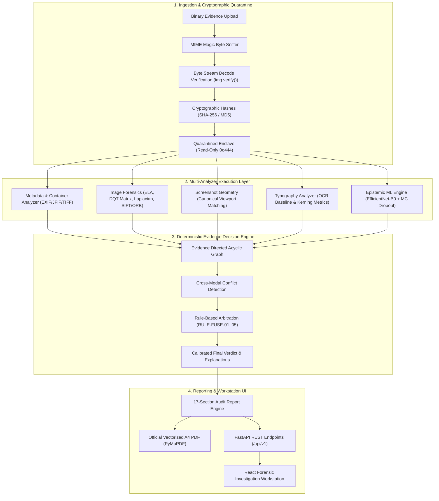

# TRUSTTRACE
## AI-Assisted Digital Evidence Verification & Tamper Detection Platform

[](file:///backend/tests)
[](file:///docs/forensic-methodology.md)
[](file:///frontend)
[](file:///backend)

TRUSTTRACE is an enterprise-grade digital forensics platform engineered to verify the authenticity, provenance, and integrity of digital evidence assets (photographs, screenshots, scanned documents, and social media media). 

Unlike conventional machine-learning-centric systems that output unverified, opaque probability scores, TRUSTTRACE is architected around the **Principle of Independent Multi-Modal Corroboration**: physical signal processing, discrete quantization tables, Error Level Analysis (ELA), keypoint cloning geometry, and container metadata are evaluated through a deterministic, graph-based **Evidence Decision Engine**.

---

## 🏛️ Evidentiary Standards & Compliance

TRUSTTRACE is designed to comply with legal evidentiary requirements for digital forensics:
- **Federal Rules of Evidence 901 & 902(13)/(14):** Self-authenticating electronic records validated via bitwise cryptographic SHA-256 and MD5 hashing, read-only quarantine enclaves (`0o444`), and persistent chain-of-custody logging.
- **The Daubert Standard (*Daubert v. Merrell Dow Pharmaceuticals*):** Peer-reviewed forensic algorithms, transparent epistemic uncertainty scoring, documented operational boundaries, and refusal to claim false certainty on degraded assets.
- **ISO/IEC 27037:2012:** Standardized digital evidence identification, collection, acquisition, and preservation.
- **Linguistic Separation of Observation vs. Interpretation:** Factual measurements (e.g., ELA variance, DQT quality factor) are strictly segregated from contextual forensic inferences. Absolute claims such as *"This proves the image is fake"* are strictly prohibited.

---

## 🔬 Core Architectural Modalities



---

## 📚 Technical Documentation Suite

Complete technical and architectural specifications are located in [`docs/`](file:///docs):

| Document | Description |
|---|---|
| [System Architecture](file:///docs/architecture.md) | Component deconstruction, multi-analyzer orchestration, quarantine enclave, and data flow. |
| [Forensic Methodology](file:///docs/forensic-methodology.md) | Mathematical formulation of ELA, DQT extraction, Laplacian focus variance, and SIFT/ORB RANSAC clustering. |
| [Machine Learning Methodology](file:///docs/ml-methodology.md) | EfficientNet-B0 classifier, Monte Carlo Dropout, temperature scaling calibration, ECE/MCE metrics, and OOD rejection. |
| [Adversarial Validation](file:///docs/validation.md) | Complete 14-category adversarial test matrix, system resilience, and edge-case behavior. |
| [Security & Threat Mitigation](file:///docs/security.md) | Quarantine architecture, magic-byte sniffing, decode verification, decompression bomb defenses, and path traversal mitigation. |
| [REST API Specification](file:///docs/api.md) | Complete OpenAPI v1 endpoint reference, request/response JSON schemas, and cURL examples. |
| [Operational Limitations](file:///docs/limitations.md) | Technical constraints, social media recompression effects, micro-image limits, and legal boundaries. |
| [Production Deployment Guide](file:///docs/deployment.md) | Hardware requirements, Docker configuration, Nginx reverse proxy, and monitoring. |

---

## 🚀 Quickstart & Execution Guide

### 1. Prerequisites
- **Python 3.10 - 3.14** (64-bit)
- **Node.js 18+** & npm (for frontend workstation)
- **Git**

### 2. Virtual Environment & Backend Setup
```powershell
# Clone the repository
git clone https://github.com/Jayyyyy246/Trustrace.git
cd Trustrace

# Create and activate virtual environment
python -m venv .venv
# On Windows PowerShell:
.\.venv\Scripts\Activate.ps1
# On Linux / macOS:
# source .venv/bin/activate

# Install backend dependencies
pip install --upgrade pip
pip install -r backend/requirements.txt
```

### 3. Frontend Setup
```powershell
cd frontend
npm install
cd ..
```

---

## 🧪 Comprehensive Verification Suite

Run all verification tests to confirm complete operational readiness across all subsystems:

### 1. Backend Automated Tests (98 Tests)
```powershell
# Run the complete test suite (includes adversarial validation, fusion engine, hashing, metadata, ML pipeline, report generation)
$env:PYTHONPATH="backend"
.\.venv\Scripts\pytest backend/tests -v
```
*Current Status: **98 / 98 tests passing**.*

### 2. Frontend Production Build & Type Checking
```powershell
cd frontend
npm run build
```
*Executes `tsc -b && vite build` (0 errors).*

### 3. Frontend Linting
```powershell
cd frontend
npm run lint
```
*Executes `oxlint` (0 errors).*

### 4. Backend Syntax & Compilation Verification
```powershell
.\.venv\Scripts\python -m compileall backend
```
*Compiles all backend modules cleanly (0 syntax or import errors).*

### 5. Machine Learning Pipeline Commands
```powershell
# 1. Train or evaluate forensic neural network
python train.py --help

# 2. Temperature scaling probability calibration
python calibrate.py --help

# 3. Model evaluation and calibration metrics (ECE/MCE)
python evaluate.py --help

# 4. Standalone inference with uncertainty estimation
python predict.py --help
```

---

## 🖥️ Running the Platform Locally

### Launching the Backend Service
Start the FastAPI server on port 8000:
```powershell
$env:PYTHONPATH="backend"
.\.venv\Scripts\uvicorn app.main:app --host 127.0.0.1 --port 8000 --reload
```
Interactive OpenAPI / Swagger UI will be available at:  
👉 **`http://127.0.0.1:8000/docs`**

### Launching the Frontend Investigation Workstation
In a separate terminal, launch the Vite development server:
```powershell
cd frontend
npm run dev
```
Access the forensic workstation interface at:  
👉 **`http://localhost:5173`**

---

## 📑 Core REST API Endpoints

| Method | Endpoint | Description |
|---|---|---|
| `GET` | `/api/v1/health` | Service health status, storage integrity, and analyzer readiness |
| `GET` | `/api/v1/evidence/dashboard/stats` | Authentic operational metrics calculated strictly from backend storage |
| `GET` | `/api/v1/evidence` | List all registered and quarantined evidence records |
| `POST` | `/api/v1/evidence/upload` | Ingest evidence into quarantine vault and run full forensic analysis |
| `GET` | `/api/v1/evidence/{evidence_id}` | Retrieve intake metadata and cryptographic hash for an evidence record |
| `GET` | `/api/v1/evidence/{evidence_id}/file` | Securely stream raw quarantined evidence bytes for UI preview |
| `GET` | `/api/v1/evidence/{evidence_id}/analysis` | Retrieve multi-modal forensic analysis and calibrated verdict |
| `GET` | `/api/v1/evidence/{evidence_id}/report` | Generate structured 17-section forensic audit digest (JSON or PDF) |
| `GET` | `/api/v1/evidence/{evidence_id}/report/pdf` | Download official vectorized A4 forensic investigation PDF report |

---

## 🔒 Security Architecture Highlights
- **Quarantine Enclave:** Assets are sealed with read-only permissions (`0o444`) in an isolated directory.
- **Containment Defenses:** Strict regex sanitization (`^[a-zA-Z0-9_\-]+$`) and canonical path boundary checks (`target.is_relative_to(base)`) prevent path traversal attacks.
- **Intake Decode Verification:** Magic byte sniffing and Pillow `img.verify()` eliminate corrupt or polyglot streams at the HTTP edge.
- **Decompression Bomb Mitigation:** Enforces Pillow `MAX_IMAGE_PIXELS` ceilings to prevent memory exhaustion attacks.
- **Zero Exposed Secrets:** All credentials, hosts, and paths are encapsulated in environment variables.

---

## 📄 License & Attribution

TRUSTTRACE is distributed for research and digital forensic investigation purposes under academic open-source licensing. Designed in compliance with ISO/IEC 27037 and the Federal Rules of Evidence.
