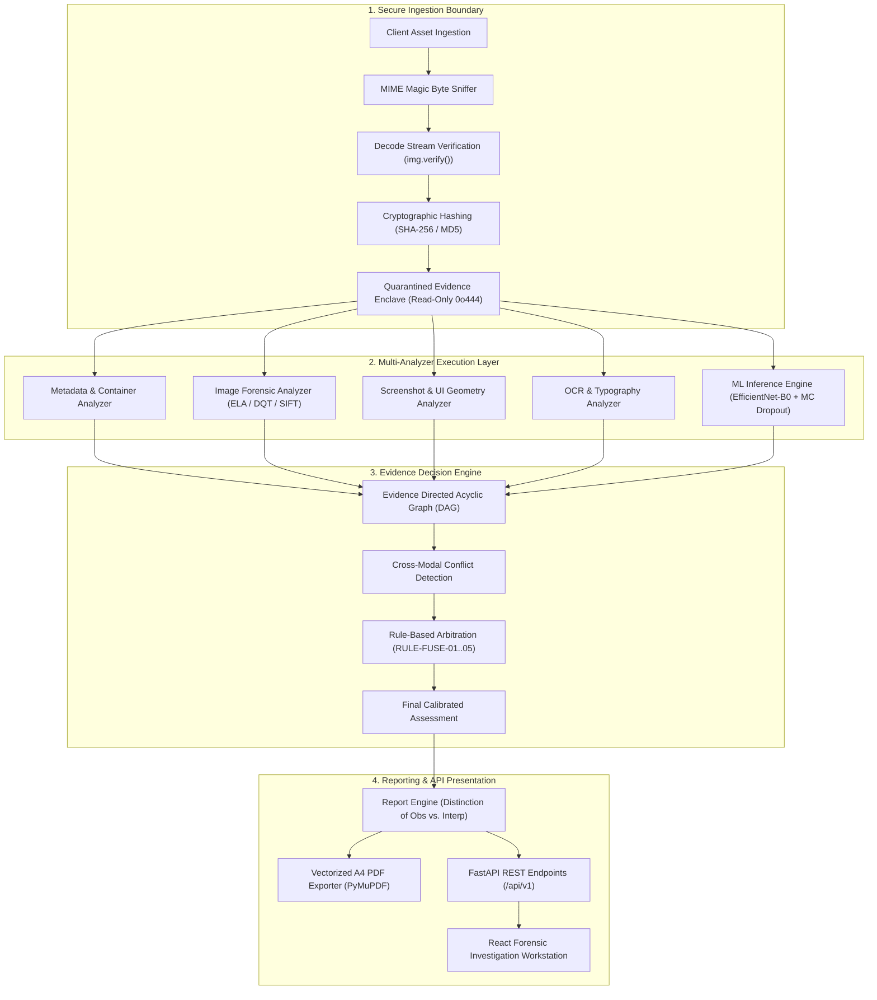

# TRUSTTRACE System Architecture Specification

**Document Version:** 1.0.0  
**Compliance Standard:** ISO/IEC 27037:2012, Federal Rules of Evidence 901 & 902(13)/(14)  
**System Classification:** Digital Evidence Verification & Tamper Detection Platform  

---

## 1. System Overview & Architectural Paradigm

TRUSTTRACE is an enterprise-grade digital forensic examination platform engineered to verify the integrity, provenance, and authenticity of digital image assets. Unlike conventional machine-learning-centric systems that output opaque probability scores, TRUSTTRACE is architected around the **Principle of Independent Multi-Modal Corroboration**.

The architecture decouples raw physical signal processing (metadata extraction, Error Level Analysis, Discrete Quantization Table parsing, keypoint displacement geometry, and typography metrics) from high-level evidential arbitration. The central orchestrator is the **Evidence Decision Engine**—a deterministic, graph-based decision framework that evaluates evidential support, detects cross-modal contradictions, arbitrates adversarial conflicts, and generates transparent, court-admissible natural language findings.

---

## 2. Component Deconstruction

### 2.1. Ingestion & Quarantined Storage Enclave (`backend/app/storage/local.py`)
- **Quarantine Enclave:** Incoming evidence payloads are stored in an isolated directory structure (`quarantine/`), detached from public web-server root paths.
- **Access Control:** Upon bitwise ingestion and hashing, file permissions are downgraded to read-only (`0o444`) to guarantee chain-of-custody preservation pursuant to FRE 902(14).
- **Containment Defenses:** Evidence identifiers are strictly sanitized using alphanumeric regular expressions (`^[a-zA-Z0-9_\-]+$`), and storage path resolutions enforce canonical containment checks via `path.resolve().is_relative_to(base_dir)`.

### 2.2. Multi-Modal Analytical Engines (`backend/forensic/`)

| Subsystem | Source Module | Primary Functions | Forensic Metrics |
|---|---|---|---|
| **Metadata Analyzer** | `forensic/metadata.py` | EXIF, TIFF, JFIF, and container header decomposition | Hardware sensor tags, editing tool signatures (Photoshop, GIMP), timestamp anomalies |
| **Image Forensic Analyzer** | `forensic/image_analysis.py` | Signal processing, compression error, spatial clustering | 8x8 DCT ELA variance, DQT quality factor, Laplacian focus variance, SIFT/ORB RANSAC clone clusters |
| **Screenshot Analyzer** | `forensic/screenshot.py` | Display viewport resolution & geometry validation | Canonical viewport matching (Desktop FHD/4K, Mobile iOS/Android), aspect ratio conformity |
| **OCR Analyzer** | `forensic/ocr.py` | Textual extraction & typographic consistency | Word/character counts, font baseline regularity, kerning standard deviation |
| **ML Inference Engine** | `model/predictor.py` | Deep feature classification & epistemic uncertainty | 5-class softmax probabilities, Monte Carlo Dropout variance, Shannon entropy |

### 2.3. The Evidence Decision Engine (`backend/forensic/decision_engine.py`)

The Evidence Decision Engine replaces monolithic black-box heuristics with an explicit **Evidence Directed Graph**:
1. **Source Registration:** Each analyzer registers its operational status (`COMPLETED`, `NOT_AVAILABLE`, `DEGRADED`, `ERROR`) and baseline reliability weight ($R \in [0.0, 1.0]$).
2. **Signal Ingestion:** Analyzers emit directional `EvidenceSignalItem` tokens targeting specific hypotheses (`REAL`, `EDITED`, `AI_GENERATED`, `SCREENSHOT_MANIPULATED`, `UNKNOWN`).
3. **Cross-Modal Conflict Detection:** The graph evaluates edge pairs against formal forensic conflict rules (e.g., optical hardware sensor EXIF vs. physical copy-move keypoint clusters).
4. **Epistemic Arbitration:** In the presence of irreconcilable friction or high epistemic uncertainty ($U > 0.40$), the engine refuses unweighted probabilistic averaging and arbitrates to `UNKNOWN` with transparent, itemized justification.

### 2.4. Forensic Reporting Engine (`backend/app/services/report_service.py`)
- Implements 17 standardized report sections compliant with legal discovery requests.
- Strictly separates **OBSERVATION** (verifiable sensor and pixel measurements) from **INTERPRETATION** (forensic deductions within operational limits).
- Generates pixel-precise, vectorized A4 PDF reports via PyMuPDF without external system font dependencies.

---

## 3. Data Flow Specification

### Step 1: Client Ingestion
The client initiates a multipart HTTP POST request to `/api/v1/evidence/upload`. The request payload is streamed into memory.

### Step 2: Intake Validation & Cryptographic Binding
1. The intake security boundary checks file size against maximum limits (default: 50 MB).
2. MIME magic bytes are evaluated (`\xFF\xD8\xFF` for JPEG, `\x89PNG\r\n` for PNG, `RIFF...WEBP` for WebP).
3. Pillow `Image.open().verify()` decodes stream structure; corrupted or truncated payloads are rejected immediately with HTTP 400.
4. Cryptographic SHA-256 and MD5 digests are computed via chunked 64 KB streaming.
5. The payload is written to the secure quarantine vault and marked read-only.

### Step 3: Parallel Analytical Extraction
If `auto_analyze=True`, the orchestrator invokes the analytical modules:
- Metadata parses EXIF and JFIF tables.
- Image forensics calculates 8x8 DCT grid ELA, extracts quantization matrices, calculates Laplacian variance, and performs feature keypoint matching.
- Screenshot analyzer compares image dimensions against canonical viewport matrices.
- OCR checks text typography.
- ML engine inspects runtime weights; if available, runs calibrated inference; if absent, logs `NOT_AVAILABLE` without simulation.

### Step 4: Graph Arbitration & Verdict Resolution
1. Signals are mapped into the `EvidenceGraph`.
2. Conflict detection identifies antagonistic evidence.
3. Decision rules are triggered.
4. The final verdict, calibrated confidence, uncertainty score, and natural language explanations are synthesized.

### Step 5: Response & Report Serialization
The analysis response is cached under a dual-key index (`evidence_id` and `analysis_id`) and returned to the client in structured JSON. If requested, an official 17-section PDF report is rendered on demand.

---

## 4. Frontend Architecture & Technology Stack

The TRUSTTRACE frontend is structured as a mission-critical forensic workstation:
- **Framework:** React 19 with TypeScript, utilizing strict typing across all forensic schemas.
- **Styling & Design System:** Tailwind CSS configured with a subdued, low-eyestrain cybersecurity palette (`#0B0F17` canvas, `#111827` cards, `#1E293B` borders, with precise forensic status accents: Emerald for authentic, Amber for warning, Rose for tampered, Sky for information).
- **Component Hierarchy:**
  - `DashboardPage`: Real operational metrics computed dynamically from backend storage.
  - `UploadPage`: Drag-and-drop secure evidence intake with client-side format filtering and progress tracking.
  - `AnalysisPage`: Forensic examination studio with 9-stage investigation timeline, ELA visualization, EXIF inspector, keypoint match summary, and conflict arbitration panels.
  - `ReportsPage`: Courtroom-ready report viewer with copyable integrity digests and one-click vectorized PDF download.
  - `ModelIntelligencePage`: Machine learning transparency hub showing checkpoint verification status, calibration metrics, and class taxonomy.
  - `DocumentationPage` & `SettingsPage`: System reference and operational health monitors.
