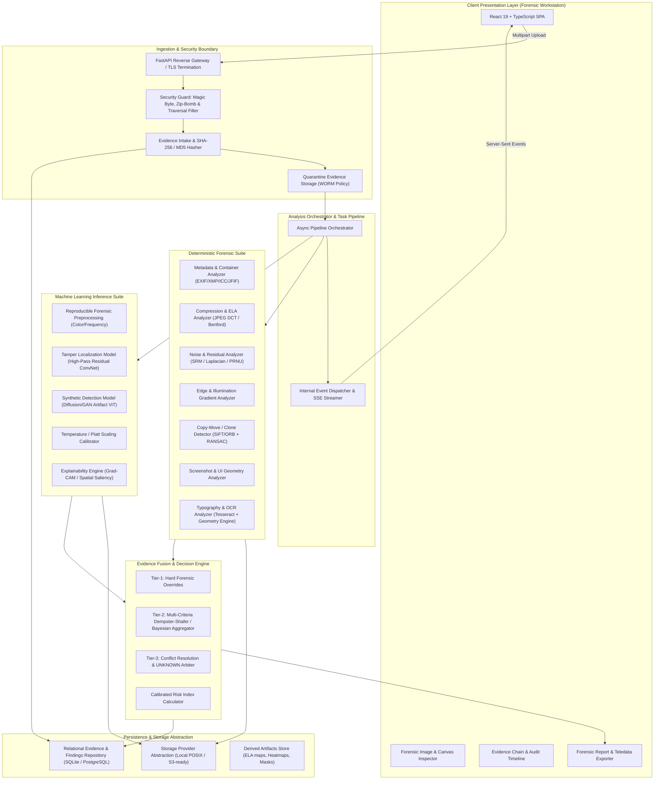
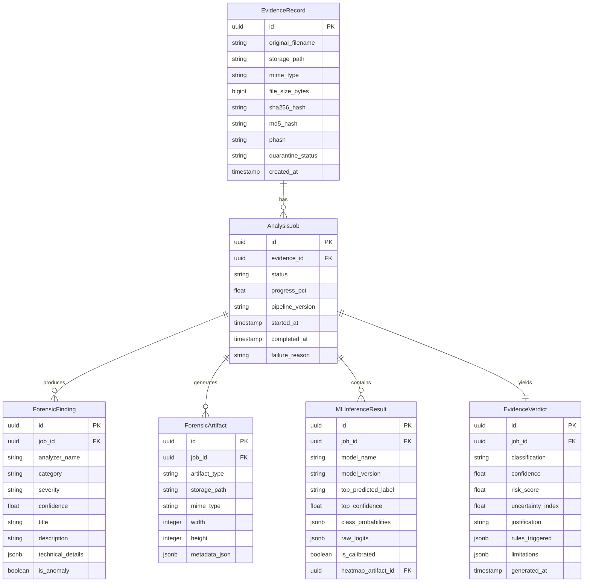

# TRUSTTRACE: AI-Assisted Digital Evidence Verification & Tamper Detection Platform
## Master Architectural Specification & Engineering Blueprint (v1.0-RC)

---

## 1. Executive Summary & Core Project Philosophy

**TRUSTTRACE** is an academic-grade, production-hardened digital forensics and evidence verification platform designed to perform multi-layered technical analysis on digital media (photographs, screenshots, scanned documents, payment proofs, and chat records).

### Core Operating Principles
1. **Evidence-First Architecture**: Deterministic physical, mathematical, and container-level forensic facts supersede probabilistic machine-learning estimations.
2. **Strict Separation of Concerns**: Observed forensic facts (e.g., EXIF history, quantization mismatches, clone keypoints) are never intermingled with heuristic model inferences.
3. **No Fabricated Certainty**: Predictions are strictly qualified assessments. The platform never claims 100% authenticity or tamper detection. Every output provides confidence intervals and operational limitations.
4. **Legitimate "UNKNOWN" Verdict**: When evidence is degraded, contradictory, or inconclusive, the platform explicitly classifies it as `UNKNOWN`, accompanied by an itemized uncertainty report.
5. **Chain of Custody & Immutability**: Uploaded digital evidence is cryptographically hashed (SHA-256, MD5) upon intake, placed into write-quarantine, and never modified in place.
6. **Zero External Leaks (Offline-First)**: Forensic analysis runs locally without piping sensitive evidence (e.g., invoices, private chats) to external third-party LLMs or closed APIs.
7. **Explainable and Defensible**: Every score, bounding box, and classification maps to a verified algorithmic finding or model activation that can be defended in an academic or legal setting.

---

## 2. Primary Classification Taxonomy

Every analyzed artifact is evaluated against five mutually exclusive primary categories, supported by fine-grained sub-indicators:

```
                      ┌─────────────────────────────────────────┐
                      │          TRUSTTRACE EVALUATION          │
                      └────────────────────┬────────────────────┘
                                           │
         ┌───────────────┬─────────────────┼─────────────────┬───────────────┐
         │               │                 │                 │               │
         ▼               ▼                 ▼                 ▼               ▼
     ┌───────┐      ┌─────────┐     ┌──────────────┐     ┌─────────────┐ ┌─────────┐
     │ REAL  │      │ EDITED  │     │ AI-GENERATED │     │ SCREENSHOT- │ │ UNKNOWN │
     │       │      │         │     │              │     │ MANIPULATED │ │         │
     └───────┘      └─────────┘     └──────────────┘     └─────────────┘ └─────────┘
```

1. **REAL (Unaltered / Native)**:
   - Media exhibits internal consistency in camera sensor PRNU, uniform JPEG compression, intact device metadata matching sensor specs, and coherent physical lighting/edge gradients.
2. **EDITED (Tampered / Spliced / Retouched)**:
   - Media demonstrates localized manipulation: ELA discrepancy, double-compression ghosting, copy-move cloning, spliced edge gradients, or software metadata tampering (Photoshop, GIMP, Canva).
3. **AI-GENERATED (Synthetic Media)**:
   - Media exhibits high-frequency generative artifacts, diffusion model frequency signatures, synthetic checkerboard patterns, irregular sensor noise floor, or deep learning feature attribution consistent with GAN/Diffusion architectures.
4. **SCREENSHOT-MANIPULATED (Forged / Fabricated UI)**:
   - Digital screenshots (chat transcripts, receipts, payment apps) showing typographical discrepancies, baseline misalignment, anti-aliasing variations, non-standard system fonts, status-bar geometry anomalies, or localized visual element insertion.
5. **UNKNOWN (Inconclusive / Indeterminate)**:
   - Low resolution, heavy aggressive multi-platform compression (e.g., repeated WhatsApp re-encodings), conflicting forensic indicators, or evidence insufficient to meet statistical certainty thresholds.

---

## 3. High-Level System Architecture



---

## 4. Repository Structure

```
trusttrace/
├── backend/
│   ├── app/
│   │   ├── api/
│   │   │   ├── v1/
│   │   │   │   ├── endpoints/
│   │   │   │   │   ├── auth.py               # Optional session / API token management
│   │   │   │   │   ├── evidence.py           # Ingestion, status, and cancellation
│   │   │   │   │   ├── analysis.py           # Trigger and query unified analysis
│   │   │   │   │   ├── forensics.py          # Detailed forensic inspection endpoints
│   │   │   │   │   ├── ml.py                 # ML predictions & explainability artifacts
│   │   │   │   │   ├── reports.py            # PDF / JSON audit report generation
│   │   │   │   │   └── system.py             # Health, capabilities, model catalog
│   │   │   │   └── router.py                 # Central v1 route aggregator
│   │   │   └── deps.py                       # Dependency injections (DB, Storage, Config)
│   │   ├── core/
│   │   │   ├── config.py                     # Strict Pydantic Settings (ENV based)
│   │   │   ├── security.py                   # Ingestion filters, path sanitizer, magic bytes
│   │   │   ├── logging.py                    # Structured JSON forensic audit logging
│   │   │   └── exceptions.py                 # Custom typed forensic domain exceptions
│   │   ├── models/                           # SQLAlchemy Declarative ORM models
│   │   │   ├── base.py
│   │   │   ├── evidence.py                   # Evidence record and hash chain
│   │   │   ├── analysis.py                   # Analysis job and status
│   │   │   ├── findings.py                   # Granular forensic findings
│   │   │   └── reports.py                    # Generated reports & verdicts
│   │   ├── schemas/                          # Pydantic v2 DTOs (Request / Response)
│   │   │   ├── evidence.py
│   │   │   ├── forensic.py
│   │   │   ├── ml.py
│   │   │   ├── fusion.py
│   │   │   ├── report.py
│   │   │   └── common.py
│   │   ├── services/                         # Business logic services
│   │   │   ├── evidence_service.py           # Intake & quarantine manager
│   │   │   ├── orchestrator.py               # Asynchronous forensic pipeline dispatcher
│   │   │   ├── fusion_service.py             # Decision engine execution
│   │   │   └── report_service.py             # Cryptographic report compiler
│   │   ├── storage/                          # Storage abstraction layer
│   │   │   ├── base.py                       # Abstract StorageProvider protocol
│   │   │   ├── local.py                      # Local POSIX secure storage
│   │   │   └── memory.py                     # In-memory mock for unit tests
│   │   └── main.py                           # FastAPI application bootstrap
│   │
│   ├── forensic/                             # Deterministic Digital Forensics Core
│   │   ├── base.py                           # BaseAnalyzer interface & result protocols
│   │   ├── hashing/                          # Cryptographic & perceptual hashing
│   │   │   ├── hasher.py                     # SHA-256, SHA-1, MD5, SHA3-512
│   │   │   └── perceptual.py                 # pHash, dHash, aHash for near-duplicate match
│   │   ├── metadata/                         # Metadata & container parsing
│   │   │   ├── exif_analyzer.py              # EXIF / TIFF / MakerNotes parser
│   │   │   ├── xmp_analyzer.py               # Adobe XMP edit history & tool signatures
│   │   │   ├── icc_analyzer.py               # Color profile & display matrix mismatch
│   │   │   └── jfif_analyzer.py              # JPEG markers, APP segments & thumbnail check
│   │   ├── compression/                      # Compression & quantization forensics
│   │   │   ├── ela.py                        # Error Level Analysis (calibrated scales)
│   │   │   ├── quantization.py               # JPEG DQT extraction & standard table comparison
│   │   │   └── double_compression.py         # Benford's Law on DCT AC coefficients
│   │   ├── noise/                            # Noise & sensor PRNU analytics
│   │   │   ├── residual.py                   # High-pass spatial filter & Laplacian residuals
│   │   │   ├── srm.py                        # Spatial Rich Models sub-filter bank
│   │   │   └── local_variance.py             # Regional noise floor inconsistency detector
│   │   ├── edges/                            # Edge, gradient, and illumination analysis
│   │   │   ├── gradient_analyzer.py          # Spliced boundary edge-gradient discontinuity
│   │   │   └── illumination.py               # Specular & directional light consistency
│   │   ├── clone/                            # Copy-move & cloning detection
│   │   │   ├── sift_orb_detector.py          # Dense keypoint extraction & RANSAC clustering
│   │   │   └── patch_match.py                # Fast patch-based hierarchical matching
│   │   ├── screenshot/                       # Screenshot structural & OS validation
│   │   │   ├── geometry_analyzer.py          # Aspect ratio, status bar & notch validation
│   │   │   ├── element_segmenter.py          # UI boundary, card & chat-bubble isolation
│   │   │   └── subpixel_analyzer.py          # Subpixel text rendering & anti-aliasing check
│   │   ├── ocr/                              # Optical Character Recognition & typography
│   │   │   ├── ocr_engine.py                 # Tesseract wrapper with bounding boxes
│   │   │   ├── font_consistency.py           # Baseline jitter, kerning & font-family anomaly
│   │   │   └── text_tamper.py                # Localized text replacement & patch detection
│   │   └── document/                         # Document & receipt specific forensics
│   │       ├── receipt_validator.py          # Alignment, grid structure, total/tax math check
│   │       └── pdf_structure.py              # Scanned PDF incremental update & font check
│   │
│   ├── ml/                                   # Machine Learning Inference & Explainability
│   │   ├── registry.py                       # Model catalog, checksums & version manifest
│   │   ├── preprocessing/                    # Deterministic image tensors & color spaces
│   │   │   ├── transforms.py                 # Normalization, resizing, SRM filter conv
│   │   │   └── patches.py                    # Overlapping patch extractor for local analysis
│   │   ├── architectures/                    # Model definitions (PyTorch)
│   │   │   ├── forensic_backbone.py          # Dual-branch ConvNeXt / EfficientNet
│   │   │   ├── synthetic_detector.py         # Frequency-aware ViT for Diffusion/GAN
│   │   │   └── segmentation_head.py          # Pixel-wise tampering localization head
│   │   ├── calibration/                      # Confidence calibration
│   │   │   ├── temperature_scaling.py        # Logit temperature scaling
│   │   │   └── platt_scaling.py              # Logistic regression on validation logits
│   │   ├── explainability/                   # Model attribution & visual explanations
│   │   │   ├── grad_cam.py                   # Layer-wise Grad-CAM / Eigen-CAM generator
│   │   │   └── overlay.py                    # Heatmap colormap & canvas alpha compositor
│   │   └── inference/                        # Production inference runtimes
│   │       ├── runner.py                     # Safe CPU/GPU execution worker
│   │       └── batch_pipeline.py             # Concurrent multi-model pipeline
│   │
│   └── tests/                                # Comprehensive test harness
│       ├── unit/                             # Isolated analyzer unit tests
│       │   ├── test_hasher.py
│       │   ├── test_exif.py
│       │   ├── test_ela.py
│       │   ├── test_noise.py
│       │   ├── test_clone.py
│       │   ├── test_screenshot.py
│       │   └── test_ocr.py
│       ├── integration/                      # End-to-end pipeline & API tests
│       │   ├── test_api_upload.py
│       │   ├── test_pipeline_flow.py
│       │   └── test_fusion_logic.py
│       ├── forensic_benchmarks/              # Ground-truth accuracy benchmarks
│       │   ├── test_pristine_camera.py       # False-positive validation
│       │   ├── test_spliced_casia.py         # Splicing tamper sensitivity
│       │   ├── test_synthetic_diffusion.py   # AI-generated sensitivity
│       │   └── test_fake_receipts.py         # Screenshot & typography checks
│       └── adversarial/                      # Evasion & noise robustness tests
│           ├── test_compression_evasion.py
│           └── test_noise_perturbation.py
│
├── frontend/
│   ├── public/                               # Static assets, fonts, icons
│   ├── src/
│   │   ├── assets/                           # SVG icons, forensic brand marks
│   │   ├── components/                       # UI Component Library
│   │   │   ├── common/                       # Buttons, Badges, Modals, Spinners, Tooltips
│   │   │   ├── layout/                       # AppHeader, NavigationSidebar, StatusBar
│   │   │   ├── workstation/                  # Core Digital Forensics Workstation
│   │   │   │   ├── EvidenceUploader.tsx      # Secure drag-and-drop intake component
│   │   │   │   ├── ImageInspector.tsx        # High-res canvas with synchronized pan/zoom
│   │   │   │   ├── OverlayLayerControl.tsx   # Toggles for ELA, Noise, Grad-CAM, Saliency
│   │   │   │   ├── MetadataTable.tsx         # Hierarchical EXIF/XMP viewer with flags
│   │   │   │   ├── OCRTextViewer.tsx         # Visual text layout, bounding boxes & text
│   │   │   │   ├── FindingsCard.tsx          # Itemized forensic indicator component
│   │   │   │   ├── RiskGauge.tsx             # Calibrated technical risk visualization
│   │   │   │   └── VerdictBadge.tsx          # REAL / EDITED / AI / SCREENSHOT / UNKNOWN
│   │   │   ├── reports/                      # Report viewer, export preview, print styles
│   │   │   └── history/                      # Evidence list, filters, search & hash lookup
│   │   ├── hooks/                            # Custom React hooks
│   │   │   ├── useEvidenceUpload.ts          # Upload state & progress
│   │   │   ├── useAnalysisStream.ts          # Server-Sent Events stream consumer
│   │   │   ├── useCanvasTransform.ts         # Viewport pan, zoom & tile coordinate math
│   │   │   └── useForensicFilters.ts         # Client-side contrast/invert/histogram preview
│   │   ├── context/                          # State management
│   │   │   ├── AnalysisContext.tsx           # Active analysis state & findings
│   │   │   └── SystemConfigContext.tsx       # Backend health & capability state
│   │   ├── services/                         # Typed API client
│   │   │   ├── api.ts                        # Axios/Fetch base instance with interceptors
│   │   │   ├── evidenceService.ts
│   │   │   └── reportService.ts
│   │   ├── types/                            # TypeScript interfaces & types
│   │   │   ├── evidence.ts
│   │   │   ├── forensics.ts
│   │   │   ├── ml.ts
│   │   │   └── reports.ts
│   │   ├── utils/                            # Formatting, hash shortening, color math
│   │   ├── styles/                           # Global CSS, theme variables, reset
│   │   │   └── workstation.css               # Precision forensic dark theme design system
│   │   ├── App.tsx                           # Main router & layout shell
│   │   └── main.tsx                          # App root
│   ├── package.json
│   ├── tsconfig.json
│   └── vite.config.ts
│
├── configs/
│   ├── base.yaml                             # Base system parameters
│   ├── forensic_thresholds.yaml              # Calibrated thresholds for ELA, Noise, Clone
│   ├── ml_models.yaml                        # Model weights paths, hashes, architectures
│   └── logging.yaml                          # Audit logging format configuration
│
├── data/
│   ├── quarantine/                           # Isolated raw evidence intake (WORM)
│   ├── artifacts/                            # Intermediate derived maps (ELA, Noise, CAM)
│   ├── reports/                              # Generated PDF & JSON forensic digests
│   └── samples/                              # Reference test evidence samples
│
├── scripts/
│   ├── download_models.py                    # Verified model weight downloader with SHA-256 check
│   ├── run_benchmarks.py                     # Execution harness for academic test sets
│   └── seed_demo_data.py                     # Populate sample evidence for workstation demo
│
├── docs/
│   ├── architecture/                         # Detailed architecture specifications
│   ├── forensics_methodology.md              # Academic documentation of algorithms
│   └── threat_model.md                       # Security & threat modeling analysis
│
├── .env.example                              # Template environment variables
├── docker-compose.yml                        # Production & local orchestrator
├── Dockerfile.backend                        # Hardened Python runtime with OpenCV & Tesseract
├── Dockerfile.frontend                       # Optimized Nginx / Vite static runtime
└── README.md                                 # Project documentation & setup instructions
```

---

## 5. Detailed Component Responsibilities & Operational Contracts

### 5.1. Secure Ingestion Guardian (`backend/app/core/security.py`)
- **Responsibility**: Gatekeeper for all incoming data buffers.
- **Enforcement Rules**:
  - File signature verification using magic bytes (`python-magic`), refusing files whose magic headers mismatch their stated extension.
  - Image size bounds check (Max dimension: 8192×8192 px; Max file size: 25 MB; Pillow `Image.MAX_IMAGE_PIXELS = 100_000_000` to prevent decompression bombs).
  - Strict filename sanitization: Replaces user filenames with cryptographic UUIDs (`uuid4()`) while preserving the sanitized original filename as display-only metadata.
  - Absolute path confinement: Resolves canonical paths and prevents directory traversal attacks (`../`).
  - Quarantine placement: Writes original stream to read-only quarantine folder with `0440` POSIX file permissions.

### 5.2. Deterministic Forensic Analyzers (`backend/forensic/`)
Every analyzer inherits from an abstract base class `BaseForensicAnalyzer` and returns a strongly-typed `ForensicAnalyzerResult`.

```python
class BaseForensicAnalyzer(ABC):
    name: str
    version: str
    category: ForensicCategory

    @abstractmethod
    def analyze(self, image_path: Path, context: AnalysisContext) -> ForensicAnalyzerResult:
        """
        Executes deterministic analysis.
        Must NEVER raise unhandled exceptions; must catch and report
        AnalyzerStatus.UNAVAILABLE or AnalyzerStatus.FAILED if execution cannot complete.
        """
        pass
```

1. **Metadata & Container Analyzer (`MetadataAnalyzer`)**:
   - Parses EXIF, TIFF, XMP, IPTC, and ICC headers.
   - Detects traces of manipulation software: Adobe Photoshop, Illustrator, GIMP, Canva, Procreate, Lightroom.
   - Verifies container consistency: Looks for mismatched JFIF APP segments, multiple quantization tables in single-channel regions, or inconsistencies between embedded EXIF thumbnails and main image pixels.
2. **Compression & Quantization Analyzer (`CompressionAnalyzer`)**:
   - **Error Level Analysis (ELA)**: Re-compresses the image at calibrated quality levels (typically 90% and 95%), subtracts the re-compressed image from the input image, magnifies the absolute error, and calculates local error variance. Spliced regions introduced from different sources or saved at different qualities appear with anomalous error distributions.
   - **Quantization Table Analysis**: Extracts Luminance ($Y$) and Chrominance ($Cb/Cr$) Discrete Cosine Transform (DCT) quantization tables; matches against an indexed database of standard digital camera tables and editing software presets.
   - **Double Compression Detection**: Analyzes histogram of rounded DCT coefficients; checks for periodic zeros or deviations from Benford's Law on the first digits of AC coefficients.
3. **Noise & Residual Analyzer (`NoiseAnalyzer`)**:
   - Applies Spatial Rich Model (SRM) linear filters (3×3 and 5×5 high-pass directional kernels) to suppress image semantic content and isolate noise residuals.
   - Computes local noise floor variance using sliding windows ($32 \times 32$). Spliced fragments sourced from foreign images exhibit distinct noise variance signatures.
4. **Copy-Move & Clone Detector (`CloneDetector`)**:
   - Uses SIFT (Scale-Invariant Feature Transform) and ORB keypoint extraction over gradient fields.
   - Computes feature vector Euclidean distances and groups candidate matches using spatial clustering.
   - Applies RANSAC (Random Sample Consensus) homography estimation to filter random texture repetitions (e.g., foliage, sand) from authentic affine-transformed duplicate patches.
5. **Screenshot & OS Structural Analyzer (`ScreenshotAnalyzer`)**:
   - Checks image dimensions against a canonical database of smartphone, tablet, and desktop display resolutions and standard aspect ratios (e.g., 19.5:9, 16:9, 20:9).
   - Segments standard mobile OS UI zones: Status bar (battery, clock, signal indicators), Navigation bar, App headers.
   - Validates horizontal and vertical alignment of chat bubbles and UI card containers against standard iOS/Android design specifications.
6. **OCR & Typography Analyzer (`TypographyOCRAnalyzer`)**:
   - Executes local Tesseract OCR engine with bounding box geometry extraction.
   - Calculates baseline linearity and inter-word/inter-character kerning consistency.
   - Evaluates subpixel anti-aliasing around text glyphs. Replaced or edited text in forged payment receipts or chat logs exhibits mismatched anti-aliasing blur and kerning jitter compared to native device-rendered UI text.

### 5.3. Machine Learning Inference Pipeline (`backend/ml/`)
- **Responsibility**: Provide complementary probabilistic assessments of spatial tampering and synthetic generative artifacts without acting as an unexplainable "black box."
- **Components**:
  1. **Dual-Branch Tamper Localization Network**:
     - *Branch A (RGB Stream)*: Standard ConvNeXt-Tiny backbone capturing semantic scene continuity.
     - *Branch B (Forensic Noise Stream)*: Input pre-filtered by high-pass constrained convolutional filters (Bayar Conv) to block semantic semantics and force the network to learn low-level interpolation and manipulation traces.
     - *Output*: Pixel-level tampering probability map ($H \times W \times 1$) indicating likelihood of localized splicing/inpainting.
  2. **Synthetic / AI-Generation Classifier**:
     - Vision Transformer (ViT) fine-tuned on frequency representations (FFT magnitude spectrum) to detect telltale spatial grid artifacts, abnormal spectral energy drop-offs, and checkerboard artifacts left by diffusion de-noising steps and GAN upsamplers.
  3. **Confidence Calibration**:
     - Softmax outputs from neural networks are notoriously overconfident. TRUSTTRACE applies **Temperature Scaling** validated on a held-out benchmark set to ensure an 80% reported probability corresponds to an empirical 80% accuracy.
  4. **Attribution & Explainability**:
     - Generates Grad-CAM visual heatmaps highlighting which spatial regions triggered the model's classification.

### 5.4. Evidence Fusion & Decision Engine (`backend/app/services/fusion_service.py`)
- **Responsibility**: Synthesizes all deterministic forensic indicators and calibrated ML outputs into a final defensible classification and calibrated Risk Index.
- **Rule Hierarchy & Fusion Methodology**:
  - **Tier 1 (Hard Deterministic Overrides)**:
    - *Rule 1.1*: If metadata reveals explicit editing software provenance (e.g., Photoshop Save History or Canva tag) AND compression shows localized ELA anomaly $\to$ `EDITED` (High confidence).
    - *Rule 1.2*: If Copy-Move analyzer discovers verified RANSAC-supported keypoint clone clusters $> 15$ matching pairs $\to$ `EDITED` (High confidence).
    - *Rule 1.3*: If typography analysis confirms mismatched font baseline or glyph anti-aliasing anomaly in a screenshot $\to$ `SCREENSHOT-MANIPULATED`.
  - **Tier 2 (Dempster-Shafer Evidence Combination)**:
    - When hard overrides do not fire, the engine combines evidence bodies from independent analyzers:
      $$m_{1 \oplus 2}(A) = \frac{\sum_{B \cap C = A} m_1(B) m_2(C)}{1 - K}$$
      where $K = \sum_{B \cap C = \emptyset} m_1(B) m_2(C)$ measures the degree of conflict between analyzers.
    - Each analyzer contributes a mass function over $\{ \text{Real}, \text{Edited}, \text{AI-Generated}, \text{Screenshot-Manipulated}, \text{Uncertainty} \}$.
  - **Tier 3 (Conflict Resolution & UNKNOWN Handling)**:
    - If the conflict metric $K$ exceeds an empirically calibrated threshold ($K > 0.45$), or if the remaining uncertainty mass $m(\Theta) > 0.40$, the engine halts automatic labeling and assigns `UNKNOWN`.
    - Generates an itemized explanation: *"High degree of contradictory indicators observed: ML predicts synthetic generation with 72% probability, but physical camera EXIF and uniform PRNU sensor noise indicate an authentic camera sensor. Evidence is classified as UNKNOWN pending manual forensic review."*

---

## 6. Comprehensive API Specification

All endpoints are versioned under `/api/v1` and return strict JSON payloads conforming to standard HTTP semantics.

### 6.1. Endpoint Summary Table

| Method | Endpoint | Description | Status Codes |
|---|---|---|---|
| `POST` | `/api/v1/evidence/upload` | Ingests raw evidence file, computes hashes, creates quarantine | `201`, `400`, `413`, `415`, `422` |
| `GET` | `/api/v1/evidence/{id}/status` | Queries ingestion & pipeline processing progress | `200`, `404` |
| `GET` | `/api/v1/evidence/{id}/stream` | Server-Sent Events (SSE) live progress and analyzer events | `200`, `404` |
| `GET` | `/api/v1/evidence/{id}/analysis` | Complete synthesized analysis, verdict, risk score & summary | `200`, `404`, `425` |
| `GET` | `/api/v1/evidence/{id}/forensics` | Detailed findings per forensic analyzer (EXIF, ELA, noise, etc.) | `200`, `404` |
| `GET` | `/api/v1/evidence/{id}/metadata` | Full extracted metadata tree (EXIF, XMP, ICC, JFIF) | `200`, `404` |
| `GET` | `/api/v1/evidence/{id}/ocr` | Extracted text, bounding boxes, baseline metrics, typography flags | `200`, `404` |
| `GET` | `/api/v1/evidence/{id}/ml-prediction` | Calibrated ML predictions, logits, and synthetic probability | `200`, `404` |
| `GET` | `/api/v1/evidence/{id}/artifacts/{type}`| Downloads derived visual artifacts (ELA map, CAM, noise map) | `200`, `404` |
| `GET` | `/api/v1/evidence/{id}/report` | Generates or fetches cryptographically signed PDF or JSON report | `200`, `404` |
| `GET` | `/api/v1/history` | Paginated list of past analyzed evidence records with filtering | `200` |
| `GET` | `/api/v1/system/health` | Service health, worker load, and hardware acceleration status | `200`, `503` |
| `GET` | `/api/v1/system/models` | Catalog of loaded ML models, versions, and verification hashes | `200` |

---

### 6.2. Detailed Request & Response Schemas

#### 1. Ingestion: `POST /api/v1/evidence/upload`
- **Request**: `multipart/form-data` with field `file` and optional `case_reference` (string).
- **Response** (`201 Created`):
```json
{
  "evidence_id": "9b1deb4d-3b7d-4bad-9bdd-2b0d7b3dcb6d",
  "filename": "payment_receipt_2026_09.png",
  "sanitized_name": "9b1deb4d-3b7d-4bad-9bdd-2b0d7b3dcb6d.png",
  "file_size": 2419082,
  "mime_type": "image/png",
  "hashes": {
    "sha256": "e3b0c44298fc1c149afbf4c8996fb92427ae41e4649b934ca495991b7852b855",
    "md5": "d41d8cd98f00b204e9800998ecf8427e",
    "phash": "a8f0c3d9b1e2c4f6"
  },
  "uploaded_at": "2026-10-02T17:45:00.120Z",
  "status": "QUEUED"
}
```

#### 2. Comprehensive Analysis: `GET /api/v1/evidence/{id}/analysis`
- **Response** (`200 OK`):
```json
{
  "evidence_id": "9b1deb4d-3b7d-4bad-9bdd-2b0d7b3dcb6d",
  "hashes": {
    "sha256": "e3b0c44298fc1c149afbf4c8996fb92427ae41e4649b934ca495991b7852b855"
  },
  "file_metadata": {
    "filename": "payment_receipt_2026_09.png",
    "file_size_bytes": 2419082,
    "dimensions": { "width": 1170, "height": 2532 },
    "color_space": "RGB",
    "format": "PNG"
  },
  "verdict": {
    "classification": "SCREENSHOT-MANIPULATED",
    "confidence": 0.88,
    "risk_score": 0.84,
    "primary_rationale": "Typography and baseline misalignment detected in transaction amount region along with localized anti-aliasing inconsistency.",
    "limitations": [
      "PNG source container has no original EXIF camera metadata.",
      "Analysis is limited to 2D image plane; compression history prior to screenshot capture is unknown."
    ]
  },
  "analyzers_summary": {
    "metadata": { "status": "COMPLETED", "flags_raised": 1 },
    "compression_ela": { "status": "COMPLETED", "flags_raised": 0 },
    "noise_residual": { "status": "COMPLETED", "flags_raised": 1 },
    "clone_detection": { "status": "COMPLETED", "flags_raised": 0 },
    "screenshot_geometry": { "status": "COMPLETED", "flags_raised": 2 },
    "ocr_typography": { "status": "COMPLETED", "flags_raised": 3 },
    "ml_synthetic_detector": { "status": "COMPLETED", "flags_raised": 0 },
    "ml_tamper_locator": { "status": "COMPLETED", "flags_raised": 1 }
  },
  "model_info": {
    "pipeline_version": "1.0.0",
    "ml_model_version": "convnext-forensic-v1.2",
    "calibrated": true,
    "analysis_timestamp": "2026-10-02T17:45:08.450Z"
  }
}
```

---

## 7. Database & Persistence Layer

The architecture uses a clean Repository / Unit-of-Work pattern over SQLAlchemy 2.0 with PostgreSQL in production and SQLite in testing/development environments. Storage of binary artifacts is mediated through the `StorageProvider` abstraction.

### 7.1. Entity-Relationship Data Model



---

## 8. Machine Learning Pipeline Architecture

### 8.1. Dual-Stream Forensic Network Architecture

The machine learning subsystem employs a specialized dual-stream network engineered specifically to prevent deep learning models from taking shortcuts based on high-level image semantics:

```
[ Input RGB Image (H x W x 3) ]
       │
       ├───► Stream 1 (RGB Semantic Branch):
       │     ConvNeXt-Tiny Pretrained
       │     Captures lighting consistency, perspective, and object coherence
       │
       └───► Stream 2 (High-Pass Forensic Stream):
             Bayar Constrained Convolutional Layer (Learnable Filter with Constrained Central Weight):
             W[k, k] = -1, sum(W) = 0
             Suppresses image scene content; exposes resampling, interpolation, and splicing residuals
       │
       ▼
[ Feature Fusion Layer: Cross-Attention Mechanism ]
       │
       ├───► Head A: Splicing Localization Mask (1 x H/8 x W/8) -> Upsampled Heatmap
       │
       └───► Head B: Global Classification Logits (Real, Edited, AI, Screenshot)
                     │
                     ▼
             [ Temperature Scaling Layer (Calibrated Probabilities) ]
```

### 8.2. Reproducibility & Model Versioning
- **Checkpointed Weights**: Model weights are stored with cryptographically verified SHA-256 hashes in `configs/ml_models.yaml`.
- **Hardware-Agnostic Execution**: The pipeline detects CUDA/ROCm acceleration; if unavailable, it runs a quantized CPU-optimized ONNX/PyTorch graph without degradation in numerical accuracy.
- **Explainability Generation**: For any positive tampering or synthetic classification, Grad-CAM attention weights are computed on the final cross-attention feature map, rendered as a standardized Jet/Turbo colormap, and persisted as a forensic artifact.

---

## 9. Deterministic Forensic Pipeline Specifications

### 9.1. Error Level Analysis (ELA) Engine
- **Algorithm**:
  1. Read original pixel array $I_{orig}$.
  2. Compress $I_{orig}$ into a temporary in-memory JPEG buffer with constant quality factor $Q = 95$.
  3. Decompress to generate $I_{recomp}$.
  4. Compute absolute difference: $\Delta(x, y) = |I_{orig}(x, y) - I_{recomp}(x, y)|$.
  5. Apply dynamic contrast scaling factor $S = \frac{255}{\max(\Delta)}$ to create the visible ELA artifact map.
  6. Calculate standard deviation and mean square error in localized spatial blocks ($16 \times 16$).
  7. Flag regions where local variance deviates by $> 3.5\sigma$ from the global image background error mean.

### 9.2. Noise Residual & SRM Filtering
- **Algorithm**:
  1. Convert image to grayscale luminance $Y$.
  2. Convolve with $3 \times 3$ Laplacian kernel:
     $$K_{Laplacian} = \begin{bmatrix} 0 & 1 & 0 \\ 1 & -4 & 1 \\ 0 & 1 & 0 \end{bmatrix}$$
  3. Convolve with $5 \times 5$ SRM edge filter to extract high-frequency noise $R$.
  4. Calculate local noise variance $\sigma_n^2$ across overlapping $32 \times 32$ tiles.
  5. Segment contiguous patches whose noise variance is statistically disconnected from the dominant camera PRNU distribution.

### 9.3. Copy-Move / Splicing Keypoint Cluster Matcher
- **Algorithm**:
  1. Extract scale-invariant features (SIFT keypoints and 128-dimensional descriptors).
  2. Compute mutual k-nearest neighbor matches ($k=2$) across the image.
  3. Discard self-matches within Euclidean spatial radius $r < 30$ pixels.
  4. Group matching keypoint pairs using DBSCAN spatial clustering on displacement vectors.
  5. Perform RANSAC affine transformation estimation on clusters with $> 5$ pairs. If RANSAC finds a consistent geometric homography, flag the clustered regions as verified cloned/copied elements.

### 9.4. Screenshot & Typography Geometry Analyzer
- **Algorithm**:
  1. Analyze outer dimension ratio against known standard viewport tables (iPhone, Samsung Galaxy, Pixel, iPad, Standard Monitors).
  2. Apply adaptive Otsu thresholding and morphological gradient operators to detect UI cards and horizontal dividing lines.
  3. Execute Tesseract OCR with `hocr` / TSV output to obtain word-level bounding boxes ($x, y, w, h$).
  4. Measure line baseline standard deviation $\sigma_{baseline}$. In authentic OS-rendered UI, text baselines have near-zero jitter ($\sigma < 0.5$ px). Hand-edited or spliced text exhibits vertical alignment deviations ($\sigma > 1.8$ px).
  5. Sample the gradient falloff around text glyph edges. Native mobile font rendering produces uniform subpixel anti-aliasing; pasted text displays mismatched edge blur or haloing from previous background colors.

---

## 10. Evidence Fusion Logic & Mathematical Formulation

### 10.1. The Conflict Problem in Forensics
Simple majority voting or weighted linear averages fail in forensic investigations:
- An image might appear 90% "Real" to a standard convolutional network because the scene is visually normal.
- However, if the Copy-Move analyzer proves a duplicate signature with 15 verified SIFT-RANSAC vector pairs, the image is indisputably **EDITED**. A naive average would wrongly drown out the deterministic forensic proof.

### 10.2. Three-Tier Decision Architecture

```
                    [ Extracted Findings from All Analyzers ]
                                       │
                                       ▼
        ┌─────────────────────────────────────────────────────────────┐
        │ TIER 1: Deterministic Hard Overrides                        │
        │ - Known editing software in EXIF history                    │
        │ - RANSAC-verified Clone clusters > 10 pairs                │
        │ - Typography baseline jitter > threshold in screenshot UI   │
        └──────────────────────────────┬──────────────────────────────┘
                                       │
                    Did any hard override trigger?
                    ├──► YES: Assign Verified Verdict (EDITED or SCREENSHOT-MANIPULATED)
                    │         Log Hard Rule ID & Exact Forensic Trigger
                    │
                    └──► NO: Proceed to Tier 2
                                       │
                                       ▼
        ┌─────────────────────────────────────────────────────────────┐
        │ TIER 2: Dempster-Shafer Multi-Criteria Evidence Fusion      │
        │ Combine independent masses:                                 │
        │ m(Real), m(Edited), m(AI), m(Screenshot), m(Uncertainty)    │
        │ Compute Conflict Metric K                                   │
        └──────────────────────────────┬──────────────────────────────┘
                                       │
                       Is Conflict K > 0.45 OR
                      Uncertainty m(Theta) > 0.40?
                    ├──► YES: Proceed to Tier 3 (UNKNOWN Arbiter)
                    │
                    └──► NO: Assign Maximum Belief Class
                             Scale Calibrated Risk Index
                                       │
                                       ▼
        ┌─────────────────────────────────────────────────────────────┐
        │ TIER 3: The UNKNOWN Arbiter                                 │
        │ - Formally declare UNKNOWN classification                   │
        │ - Itemize the conflicting vectors (e.g. ML vs Sensor Noise) │
        │ - Recommend concrete manual verification steps             │
        └─────────────────────────────────────────────────────────────┘
```

### 10.3. Calibrated Risk Index Formulation
The platform outputs a standardized **Risk Index** $R \in [0.00, 1.00]$:
$$R = 1.0 - \left( (1.0 - S_{ML}) \times \prod_{i=1}^N (1.0 - w_i \cdot s_i) \right)$$
where:
- $S_{ML}$ is the calibrated probability of tampering or synthetic generation from ML.
- $s_i \in [0, 1]$ is the anomaly severity score of forensic analyzer $i$.
- $w_i \in [0, 1]$ is the empirical reliability weight of analyzer $i$ (e.g., $w_{Clone} = 0.95$, $w_{ELA} = 0.70$, $w_{Metadata} = 0.85$).

---

## 11. Security Architecture & Threat Model

Following STRIDE methodology:

| Threat | Vulnerability Target | Platform Countermeasure |
|---|---|---|
| **Tampering / Ingestion Attack** | Malicious polyglot files, SVG XML bombs, shell injection in filenames | Strict libmagic byte validation; re-encoding through Pillow to sanitize binary structures; UUID4 filename isolation; never passing filenames to OS shells. |
| **Denial of Service (DoS)** | Decompression bombs (e.g., 100k×100k pixel images), memory exhaustion | Hard cap on memory image allocations (`MAX_IMAGE_PIXELS = 100_000_000`); max upload size 25 MB; worker task timeout of 60 seconds; async task queuing. |
| **Information Disclosure** | Leakage of internal server filesystem paths, environment variables | Strict Pydantic output filtering; path stripping in all exception handlers; absolute filesystem paths are masked to virtual identifiers (`artifact://ela/9b1d...`). |
| **Elevation of Privilege** | Code execution via malicious EXIF tags or Tesseract format bugs | Analysis workers execute in non-root sandboxed containers with `read-only` root filesystems; temporary files created in mounted isolated tmpfs volumes with `noexec` flags. |
| **Evidence Tampering** | Unauthorized mutation of submitted evidence | Quarantine storage mounted read-only (`0440` POSIX) after write; SHA-256 hash verified before and after each analyzer run; pipeline rejects analysis if hash diverges. |
| **Privacy Leakage** | Transmission of confidential documents/chats to third-party cloud | 100% offline-first analysis pipeline; no outbound external API network requests during evidence processing; zero reliance on closed LLM APIs. |

---

## 12. Frontend Information Architecture & Forensic UX

The frontend is constructed as a **Digital Forensics Workstation** engineered for clarity, technical rigor, and zero visual fluff.

### 12.1. Visual Design Language
- **Palette**: Obsidian deep slate (`#0B0F17`), Dark elevated card (`#131B2A`), Precision forensic border (`#1E293B`).
- **Telemetry Accents**:
  - `REAL`: Precision Emerald (`#10B981`)
  - `EDITED`: Warning Amber (`#F59E0B`)
  - `AI-GENERATED`: Cyber Violet (`#8B5CF6`)
  - `SCREENSHOT-MANIPULATED`: Alert Crimson (`#EF4444`)
  - `UNKNOWN`: Neutral Muted Slate (`#64748B`)
- **Typography**: Clean monospace for hashes and telemetry data (`JetBrains Mono` / `Fira Code`); modern sans-serif for interface hierarchy (`Inter` / `Outfit`).
- **No Decorative Gimmicks**: No looping neon animations, no fake progress counters, and no terminal typing simulations.

### 12.2. Screen Structure (12 Core Modules)
1. **Landing & Forensic Intake Dashboard**: Quick-drop evidence zone, system capability overview, recent chain-of-custody log.
2. **Evidence Upload & Quarantine Ingest**: Instant cryptographic hash generation, MIME sniffing display, file sanitization check.
3. **Evidence Analysis Pipeline Console**: Real-time analyzer execution timeline via Server-Sent Events (SSE).
4. **Primary Analysis Verdict View**: Verdict Badge, Calibrated Risk Gauge, Primary Rationale, and Limitations disclaimer.
5. **Interactive Forensic Image Canvas**:
   - High-performance canvas with synchronized dual-viewport (Original vs Filtered).
   - Pan, zoom, and coordinate crosshairs with pixel-level inspection.
   - Dynamic layer toggle: Raw Image, ELA map, Noise Residual, Grad-CAM Saliency, Clone Vectors, OCR Geometry.
6. **Forensic Findings Matrix**: Collapsible findings cards grouped by analyzer with exact severity, confidence, and technical description.
7. **Metadata & Container Inspector**: Searchable, hierarchical tree of EXIF, XMP, ICC, and JFIF tables with tamper warnings.
8. **OCR & Typography Inspector**: Interactive bounding-box overlay, extracted text transcript, font baseline linearity graph, anti-aliasing uniformity score.
9. **Model Prediction & Calibration Panel**: Class probability distribution, model version manifest, temperature calibration curves.
10. **Evidence Chain & Audit Timeline**: Immutable event log tracking file intake, hashing, execution steps, and report generation.
11. **Forensic Report Generator**: Cryptographically sealed summary viewer with one-click tamper-evident PDF and JSON export.
12. **Settings & Model Governance**: Hardware accelerator status, installed model verification hashes, analyzer threshold tuning.

---

## 13. Testing & Benchmarking Strategy

### 13.1. Testing Hierarchy
1. **Unit Tests (`tests/unit/`)**:
   - Test each analyzer with synthetic test tensors of known mathematical properties (e.g., verifying that a purely uniform image produces zero ELA response, or that an image with known copy-pasted blocks triggers the clone detector).
2. **Deterministic Forensic Benchmarks (`tests/forensic_benchmarks/`)**:
   - **Pristine Baseline**: 100 native uncompressed photos from Nikon, Canon, Sony, iPhone, and Android cameras $\to$ Target: $0\%$ false positive rate for `EDITED`.
   - **CASIA v2 / CoMoFoD Subsets**: Spliced and copy-move benchmark images $\to$ Target: $> 85\%$ detection accuracy.
   - **Diffusion & GAN Set**: 100 images from Midjourney v6, Stable Diffusion XL, FLUX.1, and DALL-E 3 $\to$ Target: $> 88\%$ synthetic detection rate.
   - **Forged Screenshot Benchmark**: 50 synthetic fake WhatsApp and banking receipts generated with altered fonts and misaligned baselines $\to$ Target: $> 90\%$ detection rate for `SCREENSHOT-MANIPULATED`.
3. **Adversarial & Evasion Robustness (`tests/adversarial/`)**:
   - Multi-compression degradation: Evaluate pipeline sensitivity when an edited image is compressed down to JPEG quality 40.
   - Metadata wiping: Verify that stripping EXIF does not cause the pipeline to fail or invent findings.
4. **Integration & API Tests (`tests/integration/`)**:
   - Full flow testing from `/api/v1/evidence/upload` to verdict generation, SSE stream validation, and PDF output generation.

---

## 14. Phased Development Roadmap

```
PHASE 1: Foundation, Secure Ingestion & Core Forensics (Backend Core)
├── Security filters & intake quarantine (magic byte, path sanitizer, size limiter)
├── Cryptographic hasher (SHA-256, MD5, pHash)
├── Metadata & container parser (EXIF, XMP, ICC, JFIF)
├── Compression & ELA analyzer
└── Local storage abstraction & SQLAlchemy database models

PHASE 2: Screenshot, OCR, Typography & Clone Forensics
├── Spatial noise residual & SRM filter bank
├── SIFT/ORB + RANSAC copy-move detection
├── Screenshot viewport & UI geometry validator
├── Tesseract OCR integration with typography & baseline linearity analyzer
└── Granular forensic finding models and unit test suite

PHASE 3: Machine Learning Inference, Calibration & Explainability
├── Preprocessing pipeline (reproducible tensors, frequency spectrum)
├── Dual-stream tampering localization model runtime
├── ViT-based synthetic generative image detector
├── Temperature scaling & calibration layer
└── Grad-CAM saliency map generator and artifact exporter

PHASE 4: Evidence Fusion, Decision Engine & Reporting
├── Rule-based Tier-1 override engine
├── Dempster-Shafer / Bayesian multi-criteria evidence fusion
├── Conflict resolution engine and legitimate UNKNOWN classification logic
├── Calibrated Risk Index formulation
└── Cryptographically signed PDF and JSON forensic report compiler

PHASE 5: Forensic Workstation Frontend (React 19 + TypeScript)
├── Obsidian dark-theme design system and precision component library
├── Secure evidence uploader with instant client-side hash feedback
├── Interactive dual-viewport canvas inspector with layer toggles (ELA, Noise, CAM)
├── Granular findings matrix and hierarchical metadata explorer
└── Real-time analysis status timeline via Server-Sent Events

PHASE 6: Hardening, Benchmarking, Documentation & Packaging
├── Academic benchmark suite execution (CASIA, CoMoFoD, Synthetic sets)
├── Adversarial robustness evaluation and threshold tuning
├── End-to-end integration and API test suite
├── Docker containerization with GPU/CPU auto-detection
└── Complete developer and API documentation
```
