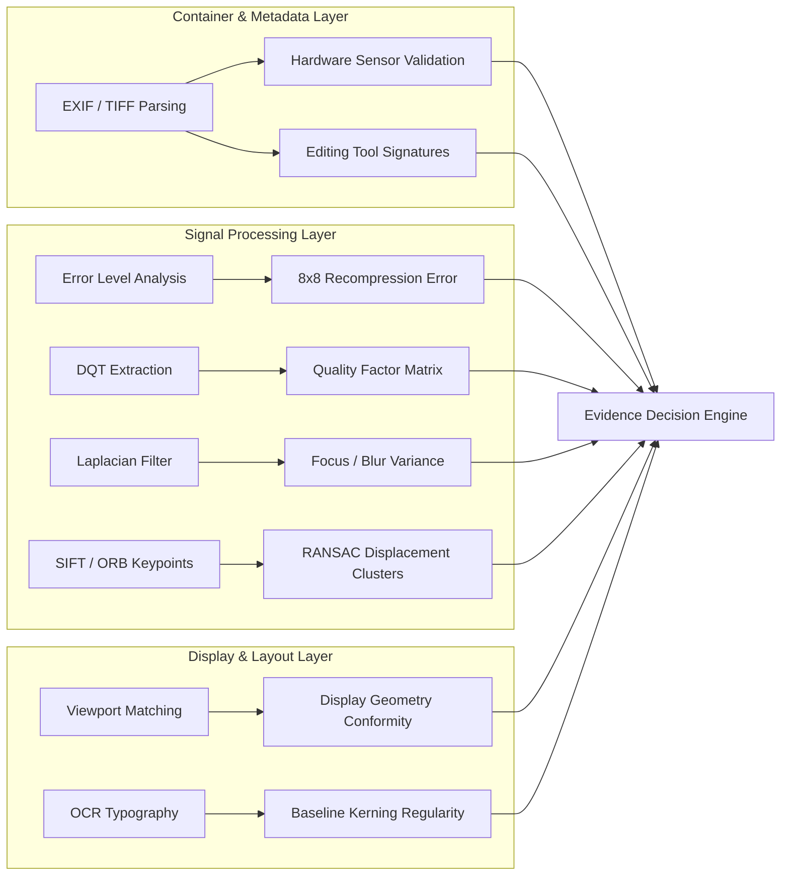

# TRUSTTRACE Forensic Methodology & Scientific Principles

**Document Version:** 1.0.0  
**Compliance Standards:** Federal Rules of Evidence 901 & 902(13)/(14), Daubert Standard (*Daubert v. Merrell Dow Pharmaceuticals, Inc.*), ISO/IEC 27037:2012  
**Domain:** Digital Multimedia Forensics, Authenticity Assessment, and Tamper Localization  

---

## 1. Legal & Regulatory Foundation

Digital evidence presented in judicial proceedings must satisfy rigorous tests of authenticity, scientific reliability, and verifiable chain-of-custody. TRUSTTRACE is architected specifically to comply with the evidentiary requirements established across federal jurisprudence and international forensic standards:

### 1.1. Federal Rules of Evidence (FRE)
- **Rule 901 (Authenticating or Identifying Evidence):** Requires a showing that the physical or digital evidence accurately represents what the proponent claims. TRUSTTRACE achieves this via multi-analyzer convergence and invariant cryptographic hashes.
- **Rule 902(13) (Certified Records Generated by an Electronic Process):** Self-authenticating electronic records validated by automated digital signatures or process certifications.
- **Rule 902(14) (Certified Data Copied from an Electronic Device):** Cryptographic verification (SHA-256 / MD5) guaranteeing that a digital asset is a bitwise identical duplicate of the original ingested file.

### 1.2. The Daubert Standard
Under *Daubert*, scientific testimony must satisfy five foundational criteria:
1. **Empirical Testing:** The underlying forensic methodology must be capable of being tested and replicated.
2. **Peer Review & Publication:** Methods (e.g., ELA, SIFT RANSAC, DQT extraction) are established in peer-reviewed scientific literature.
3. **Known or Potential Error Rates:** Algorithms disclose uncertainty scores, known limitations, and edge-case failure modes.
4. **Standards & Controls:** Execution adheres to ISO/IEC 27037 standards for digital evidence handling.
5. **General Acceptance:** Forensic metrics represent standard techniques accepted by the digital forensics community.

---

## 2. Core Forensic Analysis Modalities

---

## 3. Detailed Algorithmic Specifications

### 3.1. Error Level Analysis (ELA)
- **Scientific Premise:** When a JPEG image is modified and re-saved, the modified region is compressed an unequal number of times compared to the pristine background. The newly introduced pixels have higher error rates relative to an intentional recompression cycle.
- **Mathematical Formulation:**
  1. The input image $I$ is re-encoded into a reference lossy JPEG buffer $I_{\text{ref}}$ at a standardized quality level ($Q = 90$ or $95$).
  2. The absolute pixel-wise difference across color channels is computed:
     $$\Delta(x, y) = |I(x, y) - I_{\text{ref}}(x, y)|$$
  3. The error signal is scaled to enhance visibility across 8-bit dynamic range:
     $$\Delta_{\text{scaled}}(x, y) = \min(255, \Delta(x, y) \cdot \alpha), \quad \alpha = 10$$
  4. The spatial variance of $\Delta_{\text{scaled}}$ is calculated across the 8×8 Discrete Cosine Transform (DCT) block lattice:
     $$\sigma^2_{\text{ELA}} = \frac{1}{N} \sum_{i=1}^N (\Delta_i - \mu_{\Delta})^2$$
- **Thresholds & Inferences:**
  - $\sigma^2_{\text{ELA}} \le 40.0$: Uniform error distribution consistent with unedited, homogeneous capture.
  - $40.0 < \sigma^2_{\text{ELA}} \le 120.0$: Moderate variance consistent with natural scene complexity or minor re-saving.
  - $\sigma^2_{\text{ELA}} > 120.0$: High compression disparity indicating localized editing, subject to DQT recompression cross-checking.

### 3.2. Discrete Quantization Table (DQT) Extraction
- **Scientific Premise:** Standard digital cameras and software packages use distinct quantization tables to discard high-frequency DCT coefficients during lossy compression. Extracting these tables enables precise quality factor ($Q$) estimation.
- **Quality Factor Estimation:**
  - Evaluates luminance quantization matrix $T_L(u, v)$ against standard baseline tables defined in JPEG Annex K.
  - Computes the scaling factor $S$:
    $$S = \frac{1}{64} \sum_{u=0}^7 \sum_{v=0}^7 \frac{T_L(u, v)}{T_{\text{std}}(u, v)}$$
  - Derives effective quality factor $Q \in [1, 100]$.
- **False-Positive Mitigation:** If $\sigma^2_{\text{ELA}} > 120.0$ but $Q \le 65$, elevated variance is attributed to heavy compression degradation rather than intentional tampering, triggering an automated arbitration to `UNKNOWN`.

### 3.3. Laplacian Focus & Blur Variance
- **Scientific Premise:** The second spatial derivative of an image highlights regions of rapid intensity change (edges). Authentic, well-focused captures exhibit high edge sharpness, while heavily blurred, smoothed, or synthetic renders exhibit low edge variance.
- **Formulation:**
  $$\nabla^2 I = \frac{\partial^2 I}{\partial x^2} + \frac{\partial^2 I}{\partial y^2}$$
  Discretized using the standard 3×3 Laplacian convolution kernel:
  $$K_{\text{Lap}} = \begin{bmatrix} 0 & 1 & 0 \\ 1 & -4 & 1 \\ 0 & 1 & 0 \end{bmatrix}$$
  Variance metric:
  $$\text{Var}(\nabla^2 I) = \text{Var}(I * K_{\text{Lap}})$$
- **Thresholds:**
  - $\text{Var} < 10.0$: Low edge energy, indicating optical defocus, motion blur, or synthetic smoothing.
  - $\text{Var} \ge 10.0$: Sharp, natural optical edge definition.

### 3.4. Copy-Move & Splicing Detection (Keypoint Vector Clustering)
- **Scientific Premise:** Cloned regions contain identical or affine-transformed visual textures. SIFT (Scale-Invariant Feature Transform) and ORB (Oriented FAST and Rotated BRIEF) extract scale- and rotation-invariant feature descriptors.
- **Clustering & RANSAC Verification:**
  1. Descriptors are matched using Euclidean distance with Lowe's ratio test threshold ($d_1 / d_2 < 0.75$).
  2. Trivial adjacent keypoint pairs (spatial distance $< 20$ px) are pruned to eliminate false positives in natural repetitive textures (e.g., grass, water).
  3. Spatial displacement vectors $\vec{v}_i = (x_{2,i} - x_{1,i}, y_{2,i} - y_{1,i})$ are clustered.
  4. Parallel vector clusters with cardinality $k \ge 3$ and consistent spatial Euclidean displacement indicate copy-move cloning.

### 3.5. Container & EXIF Metadata Forensics
- **Hardware Signatures:** Scans for standard TIFF/EXIF tag groups (`Make`, `Model`, `FNumber`, `ExposureTime`, `ISOSpeedRatings`, `FocalLength`).
- **Software Fingerprints:** Scans metadata fields (`Software`, `ProcessingSoftware`, `ImageDescription`) for editing tool markers (Photoshop, GIMP, Lightroom, Canva, Snapseed).
- **Integrity Rule:** The complete absence of metadata (common on web and messaging platforms) is recorded neutrally. The platform **refuses to infer tampering from metadata omission alone**.

### 3.6. Screenshot Geometry & Display Verification
- **Viewport Profiles:** Canonical resolution catalog covering Desktop displays (1920×1080 FHD, 2560×1440 QHD, 3840×2160 4K UHD) and Mobile displays (Apple iPhone, Google Pixel, Samsung Galaxy, iPad).
- **Aspect Ratio Validation:** Evaluates dimensional aspect ratios (16:9, 16:10, 19.5:9, 4:3).
- **Localized Anomaly Detection:** Detects high-contrast spliced elements within display captures through local compression disparity and typography baseline misalignment.

---

## 4. Evidentiary Linguistic Standards

Forensic reports produced by TRUSTTRACE adhere to strict linguistic conventions to ensure objectivity and admissibility under evidentiary rules:

### 4.1. Separation of Observation from Interpretation
Every finding is explicitly decomposed into two discrete analytical components:
- **OBSERVATION:** A direct, objective measurement of the digital asset (e.g., *"Error Level Analysis variance across 8x8 block grid: 142.4; Software tag: 'Adobe Photoshop 2026'"*).
- **INTERPRETATION:** A contextual deduction framed within operational limits (e.g., *"TRUSTTRACE detected container indicators consistent with digital manipulation software. This observation records post-processing and does not prove intent"*).

### 4.2. Prohibited & Mandated Terminology

| Prohibited Language | Scientific Replacement | Rationale |
|---|---|---|
| *"This proves the image is fake."* | *"TRUSTTRACE detected indicators consistent with image manipulation."* | Digital forensics identifies technical indicators, not human legal intent. |
| *"The image is 100% authentic."* | *"TRUSTTRACE detected characteristics consistent with authentic, unmanipulated capture."* | Provenance cannot be guaranteed with absolute certainty without cryptographic hardware binding. |
| *"The system failed to detect tampering."* | *"The available evidence was insufficient to determine authenticity."* | Accurately communicates evidentiary limits in degraded or low-signal assets. |
