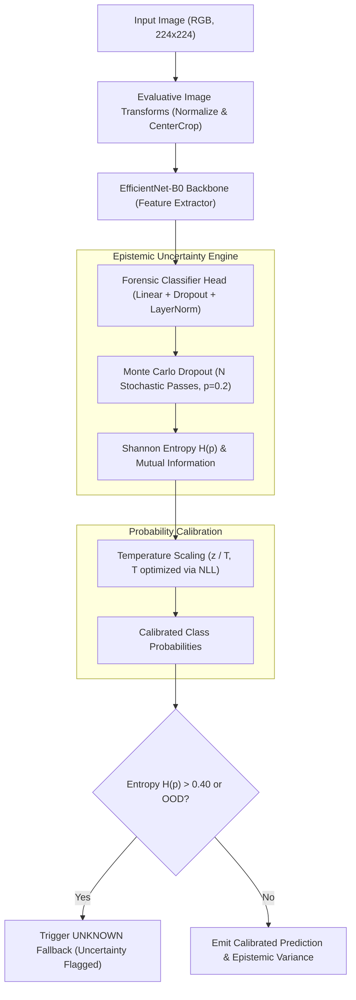

# TRUSTTRACE Machine Learning Methodology & Calibration Specification

**Document Version:** 1.0.0  
**Domain:** Deep Learning for Digital Forensics, Uncertainty Quantification, and Model Calibration  
**Compliance Standard:** ISO/IEC 24029 (Assessment of the robustness of neural networks)  

---

## 1. Machine Learning Architectural Foundation

Machine learning in digital forensics requires extreme reliability, calibrated confidence intervals, and the ability to say *"I don't know"* when encountering unfamiliar visual distributions. TRUSTTRACE employs a convolutional neural network backbone with epistemic uncertainty estimation, probability calibration, and automated out-of-distribution (OOD) rejection.



---

## 2. Model Architecture & Forensic Classification Head

- **Base Backbone:** EfficientNet-B0 architecture initialized with standard transfer learning weights or trained from scratch on forensic image corpora.
- **Input Dimensions:** 3-channel RGB tensors resized and normalized to $224 \times 224 \times 3$ using ImageNet mean/standard deviation vectors:
  $$\mu = [0.485, 0.456, 0.406], \quad \sigma = [0.229, 0.224, 0.225]$$
- **Feature Pooling:** Global average 2D pooling collapsing spatial feature maps into a 1280-dimensional latent embedding vector.
- **Forensic Head:**
  $$\mathbf{z} = \mathbf{W}_2 \cdot \text{SiLU}\left(\text{LayerNorm}(\mathbf{W}_1 \cdot \mathbf{x})\right)$$
  - Dropout layer ($p = 0.2$) retained active during both training and evaluation passes for Monte Carlo sampling.
  - Final linear projection yielding logits $\mathbf{z} \in \mathbb{R}^5$ corresponding to the 5 forensic classes.

---

## 3. Five-Class Forensic Taxonomy

TRUSTTRACE utilizes a mutually exclusive, closed-world taxonomy designed for forensic categorization:

| Class Label | Index | Target Distribution |
|---|---|---|
| `REAL` | 0 | Authentic, unmanipulated optical camera photographs and scans preserving natural sensor noise and uniform JPEG compression. |
| `EDITED` | 1 | Digital images containing localized spatial modifications, copy-move cloning, splicing, retouching, or multi-cycle compression anomalies. |
| `AI_GENERATED` | 2 | Synthetic visual assets generated by diffusion models (Stable Diffusion, Midjourney, DALL-E) or Generative Adversarial Networks (GANs). |
| `SCREENSHOT_MANIPULATED` | 3 | Digital screenshots exhibiting localized interface modifications, font kerning anomalies, or tampered UI elements. |
| `UNKNOWN` | 4 | Images with severe compression, out-of-distribution textures, or ambiguous signals where confidence cannot be certified. |

---

## 4. Leak-Free Dataset Partitioning & Training Hygiene

To prevent data contamination and overly optimistic validation scores:
1. **Cryptographic Deduplication:** Invariant SHA-256 and perceptual content hashes are computed for every candidate asset. Duplicate payloads are pruned prior to dataset assignment.
2. **Domain-Isolated Group Splitting:** Images sharing common source capture domains, camera devices, or synthetic prompt batches are assigned exclusively to a single split (Train, Validation, or Test).
3. **Split Allocations:** Standard 70% Train / 15% Validation / 15% Test partition with stratified class balance.

---

## 5. Epistemic Uncertainty Estimation (Monte Carlo Dropout)

Conventional neural networks output overconfident probabilities on out-of-distribution inputs. TRUSTTRACE quantifies model uncertainty using **Monte Carlo Dropout**:
1. During inference, dropout layers remain active with rate $p = 0.20$.
2. The network executes $M = 10$ stochastic forward passes for each input tensor:
   $$\mathbf{p}^{(m)} = \text{softmax}\left(\mathbf{z}^{(m)}\right), \quad m = 1, \dots, M$$
3. The mean predictive probability vector is computed:
   $$\bar{\mathbf{p}} = \frac{1}{M} \sum_{m=1}^M \mathbf{p}^{(m)}$$
4. Epistemic uncertainty is derived from the normalized Shannon entropy of the mean predictive distribution:
   $$H(\bar{\mathbf{p}}) = -\frac{1}{\ln K} \sum_{k=1}^K \bar{p}_k \ln \bar{p}_k, \quad K = 5$$
   supplemented by the predictive variance across passes:
   $$\text{Var}(\mathbf{p}) = \frac{1}{M} \sum_{m=1}^M \|\mathbf{p}^{(m)} - \bar{\mathbf{p}}\|^2$$

---

## 6. Post-Hoc Probability Calibration (Temperature Scaling)

Softmax scores do not inherently reflect true posterior probabilities. TRUSTTRACE implements **Temperature Scaling** to align confidence with empirical accuracy:

### 6.1. Formulation
A single learned positive scalar $T > 0$ scales the pre-softmax logits:
$$\hat{p}_k = \frac{\exp(z_k / T)}{\sum_{j=1}^K \exp(z_j / T)}$$
- $T = 1.0$: Uncalibrated baseline logits.
- $T > 1.0$: De-biases overconfident models, softening output probabilities.
- $T < 1.0$: Sharpens underconfident distributions.

### 6.2. Optimization
Temperature $T$ is optimized on the hold-out validation dataset by minimizing the Negative Log-Likelihood (NLL) using L-BFGS:
$$\min_{T} -\sum_{i=1}^N \sum_{k=1}^K y_{i,k} \ln \left(\frac{\exp(z_{i,k} / T)}{\sum_{j=1}^K \exp(z_{i,j} / T)}\right)$$

### 6.3. Calibration Assessment Metrics
- **Expected Calibration Error (ECE):**
  $$\text{ECE} = \sum_{m=1}^B \frac{|B_m|}{N} |\text{acc}(B_m) - \text{conf}(B_m)|$$
  where predictions are grouped into $B = 10$ confidence bins.
- **Maximum Calibration Error (MCE):**
  $$\text{MCE} = \max_{m=1,\dots,B} |\text{acc}(B_m) - \text{conf}(B_m)|$$

---

## 7. Out-of-Distribution (OOD) Rejection Protocol

To prevent catastrophic false certainty in adversarial or unseen environments:
1. **Entropy Threshold:** If the normalized predictive entropy $H(\bar{\mathbf{p}}) > 0.40$, the model automatically rejects the prediction.
2. **Confidence Threshold:** If the maximum class probability $\max_k \bar{p}_k < 0.60$, the output is designated ambiguous.
3. **Fallback Attribution:** When either threshold is breached, the ML analyzer returns `predicted_label: UNKNOWN` with an explanatory finding and sets `uncertainty: 1.0`. The Evidence Decision Engine then resolves the final verdict relying exclusively on deterministic signal processors.

---

## 8. Checksum Verification & Model Integrity

Pursuant to Federal Rule of Evidence 902(13), machine learning checkpoints must maintain a cryptographically certified chain of custody:
1. **Model Checksum Binding:** Every trained checkpoint file (`.pt` or `.pth`) is hashed using SHA-256 upon export.
2. **Runtime Verification:** Prior to weights loading, `ForensicPredictor` recomputes the SHA-256 digest of the weight file and compares it against the registered metadata manifest. If digests mismatch, execution halts with a `ModelIntegrityError`.
3. **Honest Runtime State:** When checkpoint weights are not present in the runtime environment, the ML service explicitly reports:
   ```json
   {
     "model_status": "NOT_AVAILABLE",
     "predicted_label": "UNKNOWN",
     "confidence": null,
     "uncertainty": null,
     "note": "Deep learning models not active in runtime. Skipping ML inference to avoid fabricated probabilistic outputs."
   }
   ```
   Simulated, placeholder, or pseudo-random predictions are strictly prohibited.
