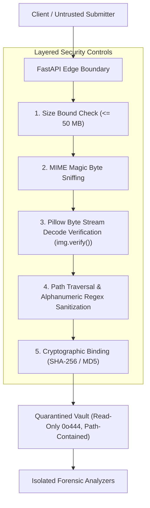

# TRUSTTRACE Security & Threat Mitigation Specification

**Document Version:** 1.0.0  
**Classification:** Forensics Platform Security Architecture & Vulnerability Mitigation  
**Standards:** ISO/IEC 27037:2012, NIST SP 800-86 (Guide to Integrating Forensic Techniques into Incident Response), OWASP Top 10 API Security  

---

## 1. Threat Model & Security Posture

As a forensic examination platform, TRUSTTRACE ingests untrusted binary files from external, potentially hostile actors. The threat model accounts for adversarial actors attempting to:
1. Exploit media parser vulnerabilities (e.g., buffer overflows in image decoders).
2. Execute path traversal attacks to read, overwrite, or corrupt evidence on the host filesystem.
3. Launch Denial of Service (DoS) attacks via decompression bombs (zip bombs / pixel bombs).
4. Circumvent evidence validation via extension spoofing or polyglot payloads.
5. Tamper with quarantined digital evidence or fabricate forensic conclusions.



---

## 2. Evidence Ingestion & Quarantined Storage Enclave

### 2.1. Quarantined Storage Architecture (`backend/app/storage/local.py`)
- **Enclave Isolation:** All ingested evidence is stored within a dedicated storage enclave (`quarantine/`) isolated from web server root directories and executable paths.
- **Read-Only Permission Hardening:** Immediately upon saving an evidence payload, file permissions are changed to read-only (`0o444` on POSIX systems; write-restricted on Windows) to prevent post-intake tampering and satisfy chain-of-custody requirements under FRE 902(14).
- **Startup Storage Re-indexing:** Upon service startup, the storage manager re-indexes all existing quarantined assets and recomputes hashes if necessary, ensuring persistent custody tracking across server restarts.

### 2.2. Path Traversal & Boundary Containment Defenses
- **Identifier Sanitization:** All incoming `evidence_id` strings and filenames are stripped of dangerous characters using strict alphanumeric regular expressions:
  ```python
  sanitized_id = re.sub(r"[^a-zA-Z0-9_\-]", "", evidence_id)
  ```
- **Canonical Boundary Containment:** Target filesystem paths are resolved to their canonical absolute representation and verified to reside strictly within the configured storage directory:
  ```python
  target_path = (self.base_dir / f"{sanitized_id}{suffix}").resolve()
  if not target_path.is_relative_to(self.base_dir.resolve()):
      raise SecurityError("Access denied: Path traversal attempt detected outside quarantine enclave.")
  ```
  This defends against directory traversal payloads (`../../etc/passwd`, `..\\Windows\\System32`).

---

## 3. Upload & Payload Validation Defenses

### 3.1. Deterministic Magic Byte Sniffing
Client-provided `Content-Type` headers and file extensions are untrusted. TRUSTTRACE inspects the initial byte signatures to determine the true container format:

| Format | Magic Byte Signature | Validation Rule |
|---|---|---|
| **JPEG** | `\xFF\xD8\xFF` | Matches standard JFIF/EXIF SOI markers |
| **PNG** | `\x89\x50\x4E\x47\x0D\x0A\x1A\x0A` | 8-byte PNG header |
| **WebP** | `RIFF....WEBP` | RIFF container header with WEBP fourcc |
| **TIFF** | `II*\x00` (Little Endian) or `MM\x00*` (Big Endian) | TIFF header |
| **BMP** | `BM` | Bitmap header |

Payloads with spoofed extensions (e.g., an executable `.exe` renamed to `.png`, or ASCII text saved as `.jpg`) are rejected at the edge with HTTP 400 (`MIME signature mismatch`).

### 3.2. Byte Stream Decode Verification (`img.verify()`)
Magic byte checking alone is insufficient to prevent parser crashes from truncated or corrupt byte streams. Every upload is decoded in memory using Pillow's `verify()` routine before being written to disk:
```python
try:
    with Image.open(io.BytesIO(file_bytes)) as img:
        img.verify()
except Exception as e:
    raise EvidenceValidationError(f"Invalid or corrupted image payload: {e}")
```
This guarantees that malformed or truncated files cannot enter the analytical pipeline.

### 3.3. Decompression Bomb Defenses (Pixel Bombs)
Adversarial images can specify massive dimension headers (e.g., 100,000 × 100,000 pixels) requiring gigabytes of RAM upon decompression. TRUSTTRACE enforces:
- Pillow's `Image.MAX_IMAGE_PIXELS` allocation safety limit (default: 89,478,485 pixels ~ 89.5 MP).
- Hard dimension ceilings and streaming processing to prevent Out-Of-Memory (OOM) crashes.

---

## 4. API Security & Error Handling Hygiene

### 4.1. Non-Leaking Structured Error Envelopes
To prevent information leakage (e.g., stack traces, host paths, internal framework versions), domain exceptions are captured and wrapped in a standard structured JSON error envelope:
```json
{
  "error": {
    "code": "EVIDENCE_VALIDATION_ERROR",
    "message": "Unsupported file format. Detected MIME type is 'text/plain'.",
    "path": "/api/v1/evidence/upload"
  },
  "detail": "Unsupported file format. Detected MIME type is 'text/plain'."
}
```
Internal server errors log diagnostic tracebacks to secure local application logs while presenting safe, non-revealing error messages to the client.

### 4.2. CORS & Access Configuration
Cross-Origin Resource Sharing (CORS) is configured via environment settings (`CORS_ORIGINS`). In production deployments, wildcard origins (`*`) are replaced with the specific origin of the frontend workstation.

---

## 5. Secret Hygiene & Configuration Management

- **Zero Hardcoded Secrets:** No API keys, passwords, database credentials, or private cryptographic keys exist in source control.
- **Environment Encapsulation:** Operational parameters (ports, storage directories, model paths, logging levels) are managed through standard Pydantic `BaseSettings` reading from `.env` files or environment variables.
- **Model Checksum Pinning:** Machine learning model weights must match their pre-registered cryptographic SHA-256 hashes before execution. Untrusted or modified weight files are rejected.
